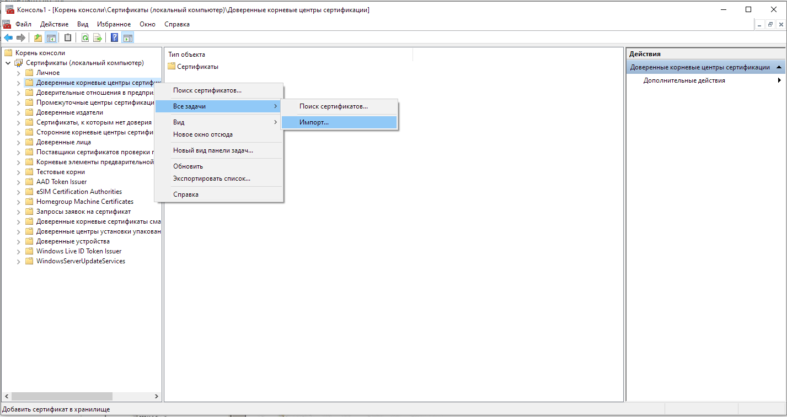

# Service Oriented Architecture. Laboratory Work 2

### Variant 3005.11

### How to deploy

#### External Tomcat
1. startup tomcat server
2. Add a corresponding server block to your settings.xml (Usually `C:\Users\user\.m2\settings.xml`:
```xml
<settings>
  ...
  <servers>
    ...
    <server>
      <id>myserver</id>
      <username>myusername</username>
      <password>mypassword</password>
    </server>
    ...
  </servers>
  ...
</settings>
```

3. In pom.xml edit tomcat data
```xml
<configuration>
    <url>http://localhost:26449/manager/text</url>
    <server>TomcatHelios</server>
    <path>/soa-storage</path>
</configuration>
```
4. In `path/to/tomcat/bin` edit `setenv.sh` (if not presented - create) and setup env vars described below.
You can use `VAR_NAME=VALUE; export VAR_NAME`
5. Build project with `mvn clean install`
6. Deploy with command `mvn tomcat7:deploy`
7. Next times you can redeploy with `mvn tomcat7:redeploy`

#### Environment settings
| Variable    | Required           | Example   |
|-------------|--------------------|-----------|
| DB_NAME     | :white_check_mark: | `soa      ` |
| DB_HOST     | :white_check_mark: | `127.0.0.1` |
| DB_PORT     | :white_check_mark: | `5432     ` |
| DB_USER     | :white_check_mark: | `postgres ` |
| DB_PASS     | :white_check_mark: | `postgres ` |
| DB_SHOW_SQL | :x:                | `false`     |
| DB_USE_SQL_COMMENTS | :x:        | `false`     |

### Setup SSL on tomcat

1. Generate keystore and certificate with next 2 commands
2. `keytool -genkeypair -keystore server.keystore -alias localhost -ext san=dns:localhost -keyalg rsa -deststoretype jks Picked up _JAVA_OPTIONS: -Xmx128M -Xms128M`
3. `keytool -keystore server.keystore -alias localhost -ext san=dns:localhost -exportcert -rfc > server.crt`
4. `keytool -import -noprompt -alias localhost -file server.crt -storepass ${PASSPHRASE} -keystore truststore.jks`
5. open `$CATALINA_BASE/conf/server.xml` (if `$CATALINA_BASE` not set - it is `/path/to/apache-base-dir`)
6. To Connectors section add
```xml

<Connector  port="26443"
            protocol="HTTP/1.1"
            maxThreads="150"
            scheme="https"
            secure="true"
            SSLEnabled="true"
            SSLCertificateFile="server.crt"
            keystoreFile="server.keystore"
            keyAlias="localhost"
            keystorePass="password"
            clientAuth="false"
            sslProtocol="TLS"
            ciphers="TLS_ECDHE_RSA_WITH_AES_128_CBC_SHA256,TLS_ECDHE_RSA_WITH_AES_128_CBC_SH
A,TLS_ECDHE_RSA_WITH_AES_256_CBC_SHA384,TLS_ECDHE_RSA_WITH_AES_256_CBC_SHA,TLS_ECDHE_RSA_WI
TH_RC4_128_SHA,TLS_RSA_WITH_AES_128_CBC_SHA256,TLS_RSA_WITH_AES_128_CBC_SHA,TLS_RSA_WITH_AE
S_256_CBC_SHA256,TLS_RSA_WITH_AES_256_CBC_SHA,SSL_RSA_WITH_RC4_128_SHA"
            sslEnabledProtocols="TLSv1.2,TLSv1.1,TLSv1"
/>

```
4. If you chose another port instead of 8443 you need to change `redirectPort` in your default connectors
5. Now your can access your app with https, but got `MOZILLA_PKIX_ERROR_SELF_SIGNED_CERT` or analogical error because of self-signed
   cert
   
### Only HTTPS in app
To `web.xml` add next configuration part
```xml
<security-constraint>
    <web-resource-collection>
        <web-resource-name>Secured</web-resource-name>
        <url-pattern>/*</url-pattern>
    </web-resource-collection>

    <user-data-constraint>
        <transport-guarantee>CONFIDENTIAL</transport-guarantee>
    </user-data-constraint>
</security-constraint>
```

### CORS settings
To `web.xml` add next configuration part
```xml
<filter>
    <filter-name>CorsFilter</filter-name>
    <filter-class>org.apache.catalina.filters.CorsFilter</filter-class>
    <init-param>
        <param-name>cors.allowed.origins</param-name>
        <param-value>*</param-value>
    </init-param>
    <init-param>
        <param-name>cors.allowed.methods</param-name>
        <param-value>GET,POST,HEAD,OPTIONS,PUT,DELETE</param-value>
    </init-param>
    <init-param>
        <param-name>cors.exposed.headers</param-name>
        <param-value>Access-Control-Allow-Origin,Access-Control-Allow-Credentials</param-value>
    </init-param>
</filter>
```

### Fix Self-Signed certificate error

1. To fix this error you need to download `server.crt` to your computer and add to trusted
2. `Win + R` and run `mmc`
   
3. Add certificate
4. Click `Ctrl + M`
   
5. Choose certificates and click `Add`
   
6. Enter the last choice and next
   
7. Choose local computer
   
8. Choose Trusted root certificate folder and click `All Tasks > import` in context menu
   
9. Next
   
10. Next
   
11. Restart your browser

### Another way to generate certs for emulation chain
```shell
# Create a Root-CA private keystore capable of issuing SSL certificates
keytool -genkeypair -noprompt -alias my-ca -keyalg RSA -keysize 2048 -dname CN=localhost -validity 3650 -keystore \
my-ca.jks -storepass pass77 -keypass pass77 \
-ext ku:critical=cRLSign,keyCertSign \
-ext bc:critical=ca:true,pathlen:1

keytool -genkeypair -noprompt -alias my-ca -keyalg RSA -keysize 2048 -dname CN=localhost -validity 3650 -keystore \
my-ca.jks -storepass pass77 -keypass pass77 \
-ext ku:critical=cRLSign,keyCertSign \
-ext bc:critical=ca:true,pathlen:1


# Export the Root-CA certificate, to be used in the final SSL chain
keytool -exportcert -alias my-ca -keystore my-ca.jks -storepass pass77 -keypass pass77 -file my-ca.crt -rfc \
-ext ku:critical=cRLSign,keyCertSign \
-ext bc:critical=ca:true,pathlen:1

# Create a container SSL private keystore (external localhost.foo.bar dns entry optional:IE11 domain intranet policy)
keytool -genkeypair -noprompt -alias my-ssl -keyalg RSA -keysize 2048 -dname CN=localhost -validity 3650 -keystore \
my-ssl.jks -storepass pass77 -keypass pass77 \
-ext ku:critical=digitalSignature,keyEncipherment \
-ext eku=serverAuth,clientAuth \
-ext san=dns:localhost,dns:localhost.foo.bar \
-ext bc:critical=ca:false

# Create a certificate signing request (CSR) from our SSL private keystore
keytool -certreq -keyalg RSA -alias my-ssl -file my-ssl.csr -keystore my-ssl.jks -keypass pass77 -storepass pass77

# Issue an SSL certificate from the Root-CA private keystore in response to the request (external localhost.foo.bar dns entry optional)
keytool -keypass pass77 -storepass pass77 -validity 3650 -keystore my-ca.jks -gencert -alias my-ca -infile my-ssl.csr \
 -ext ku:critical=digitalSignature,keyEncipherment \
 -ext eku=serverAuth,clientAuth \
 -ext san=dns:localhost,dns:localhost.foo.bar \
 -ext bc:critical=ca:false \
 -rfc -outfile my-ssl.crt

# Import Root-CA certificate into SSL private keystore
keytool  -noprompt -import -trustcacerts -alias my-ca -file my-ca.crt -keystore my-ssl.jks \
-keypass pass77 -storepass pass77

# Import an SSL (chained) certificate into keystore
keytool -import -trustcacerts -alias my-ssl -file my-ssl.crt -keystore my-ssl.jks \
-keypass pass77 -storepass pass77 -noprompt

# you got such files
# * my-ca.jks
# * my-ca.crt
# * my-ssl.jks
# * my-ssl.csr
# * my-ssl.crt
```

Result Connector config

```xml

<Connector port="26443"
           protocol="HTTP/1.1"
           maxThreads="150"
           scheme="https"
           secure="true"
           SSLEnabled="true"
           keystoreFile="my-ssl.jks"
           keyAlias="my-ssl"
           keystorePass="pass77"
           SSLCertificateFile="my-ssl.crt"
           clientAuth="false"
           sslProtocol="TLS"
           ciphers="TLS_ECDHE_RSA_WITH_AES_128_CBC_SHA256,TLS_ECDHE_RSA_WITH_AES_128_CBC_SH
A,TLS_ECDHE_RSA_WITH_AES_256_CBC_SHA384,TLS_ECDHE_RSA_WITH_AES_256_CBC_SHA,TLS_ECDHE_RSA_WI
TH_RC4_128_SHA,TLS_RSA_WITH_AES_128_CBC_SHA256,TLS_RSA_WITH_AES_128_CBC_SHA,TLS_RSA_WITH_AE
S_256_CBC_SHA256,TLS_RSA_WITH_AES_256_CBC_SHA,SSL_RSA_WITH_RC4_128_SHA"
           sslEnabledProtocols="TLSv1.2,TLSv1.1,TLSv1"
/>
```

### Доработать веб-сервис и клиентское приложение из лабораторной работы #1 следующим образом:

1. Отрефакторить сервис из лабораторной работы #1, переписав его на фреймворке Spring MVC REST с сохранением
   функциональности и API. Набор функций, реализуемых сервисом, изменяться не должен!
2. Развернуть переработанный сервис на сервере приложений Tomcat.
3. Разработать новый сервис, вызывающий API существующего.
4. Новый сервис должен быть разработан на базе JAX-RS и развёрнут на сервере приложений Payara.
5. Разработать клиентское приложение, позволяющее протестировать API нового сервиса.
6. Доступ к обоим сервисам должен быть реализован с по протоколу https с самоподписанным сертификатом сервера. Доступ к
   сервисам посредством http без шифрования должен быть запрещён.

### Новый сервис должен располагаться на URL /route и реализовывать следующие операции:

```
/calculate/length/{id1}/{id2} : рассчитать длину маршрута из города с id=id1 в город с id=id2
/calculate/to-max-populated : рассчитать длину маршрута от точки с координатами (0,0,0) до города с максимальным населением
```

### Оба веб-сервиса и клиентское приложение должны быть развёрнуты на сервере helios.

### Вопросы к защите лабораторной работы:

1. Разработка RESTful веб-сервисов на платформе Java EE. Технология JAX-RS.
2. Основные и вспомогательные аннотации JAX-RS.
3. Описание ресурсов в JAX-RS.
4. Разработка RESTful веб-сервисов на платформе Spring.
5. Технология Spring Web MVC REST. Отношение к Spring Web MVC, сходства и отличия от JAX-RS.
6. Элементы архитектуры Spring Web MVC: Dispatcher Servlet, Handler Mapping, View Resolver.
7. Аннотации Spring Web MVC.
8. Сериализация / десериализация данных в Spring Web MVC REST.
9. Технология Spring Data REST. Преимущества и недостатки относительно JAX-RS и Spring Web MVC REST.
10. Spring Data REST: стратегии экспорта репозиториев, типы ресурсов, автоматическое описание сервисов.
11. Интеграция веб-сервисов. Настройка защищённого соединения между узлами. Основы криптографии.
12. TLS & SSL. Основные термины.
13. Симметричное и асимметричное шифрование. Приватный и публичный ключи, сертификаты. Генерация сертификатов.
14. Доверенные центры сертификации. Иерархия сертификатов, самоподписанные сертификаты.
15. Настройка защищённого соединения в Java. Доверенные узлы, хранилища сертификатов.
16. Keystore & Truststore. Утилита keytool.

# Service Oriented Architecture. Laboratory Work 1

### Variant 3005

Разработать веб-сервис на базе сервлета, реализующий управление коллекцией объектов, и клиентское веб-приложение,
предоставляющее интерфейс к разработанному веб-сервису. В коллекции необходимо хранить объекты класса City, описание
которого приведено ниже:

```java
public class City {
    private Integer id; //Поле не может быть null, Значение поля должно быть больше 0, Значение этого поля должно быть уникальным, Значение этого поля должно генерироваться автоматически
    private String name; //Поле не может быть null, Строка не может быть пустой
    private Coordinates coordinates; //Поле не может быть null
    private java.time.ZonedDateTime creationDate; //Поле не может быть null, Значение этого поля должно генерироваться автоматически
    private Integer area; //Значение поля должно быть больше 0, Поле не может быть null
    private Integer population; //Значение поля должно быть больше 0, Поле не может быть null
    private float metersAboveSeaLevel;
    private int populationDensity; //Значение поля должно быть больше 0
    private Integer carCode; //Значение поля должно быть больше 0, Максимальное значение поля: 1000, Поле может быть null
    private Climate climate; //Поле не может быть null
    private Human governor; //Поле может быть null
}

public class Coordinates {
    private long x; //Значение поля должно быть больше -667
    private int y;
}

public class Human {
    private java.time.LocalDate birthday;
}

public enum Climate {
    RAIN_FOREST,
    MONSOON,
    SUBARCTIC
}
```

### Веб-сервис должен удовлетворять следующим требованиям:

- API, реализуемый сервисом, должен соответствовать рекомендациям подхода RESTful.
- Необходимо реализовать следующий базовый набор операций с объектами коллекции:
    * добавление нового элемента
    * получение элемента по ИД
    * обновление элемента
    * удаление элемента
    * получение массива элементов.
- Операция, выполняемая над объектом коллекции, должна определяться методом HTTP-запроса.
- Операция получения массива элементов должна поддерживать возможность сортировки и фильтрации по любой комбинации полей
  класса, а также возможность постраничного вывода результатов выборки с указанием размера и порядкового номера
  выводимой страницы.
- Все параметры, необходимые для выполнения операции, должны передаваться в URL запроса.
- Данные коллекции, которыми управляет веб-сервис, должны храниться в реляционной базе данных.
- Информация об объектах коллекции должна передаваться в формате json.
- В случае передачи сервису данных, нарушающих заданные на уровне класса ограничения целостности, сервис должен
  возвращать код ответа http, соответствующий произошедшей ошибке.
- Веб-сервис должен быть "упакован" в веб-приложение, которое необходимо развернуть на сервере приложений Tomcat.

### Помимо базового набора, веб-сервис должен поддерживать следующие операции над объектами коллекции:

- Вернуть количество объектов, значение поля climate которых больше заданного.
- Вернуть массив объектов, значение поля name которых содержит заданную подстроку.
- Вернуть массив объектов, значение поля name которых начинается с заданной подстроки.

### Эти операции должны размещаться на отдельных URL.

### Требования к клиентскому приложению:

- Клиентское приложение может быть написано на любом веб-фреймворке, который можно запустить на сервере helios.
- Клиентское приложение должно обеспечить полный набор возможностей по управлению объектами коллекции, предоставляемых
  веб-сервисом -- включая сортировку, фильтрацию и постраничный вывод.
- Клиентское приложение должно преобразовывать передаваемые сервисом данные в человеко-читаемый вид -- параграф текста,
  таблицу и т.д.
- Клиентское приложение должно информировать пользователя об ошибках, возникающих на стороне сервиса, в частности, о
  том, что сервису были отправлены невалиданые данные.

### Веб-сервис и клиентское приложение должны быть развёрнуты на сервере helios.

### Вопросы к защите лабораторной работы:

- Подходы к проектированию приложений. "Монолитная" и сервис-ориентированная архитектура.
- Понятие сервиса. Общие свойства сервисов.
- Основные принципы SOA. Подходы к реализации SOA, стандарты и протоколы.
- Общие принципы построения и элементы сервис-ориентированных систем.
- Понятие веб-сервиса. Определение, особенности, отличия от веб-приложений.
- Категоризация веб-сервисов. RESTful и SOAP. Сходства и отличия, области применения.
- RESTful веб-сервисы. Особенности подхода. Понятия ресурса, URI и полезной нагрузки (payload).
- Виды RESTful-сервисов. Интерпретация методов HTTP в RESTful.
- Правила именования ресурсов в RESTful сервисах.
- Разработка RESTful сервисов. Языки программирования, фреймворки и библиотеки.

